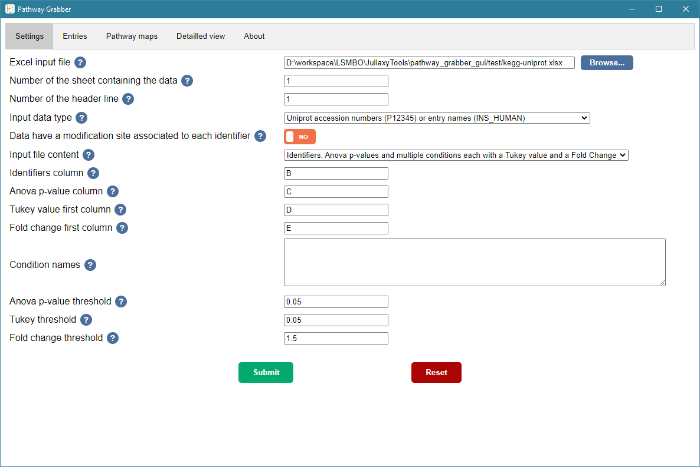
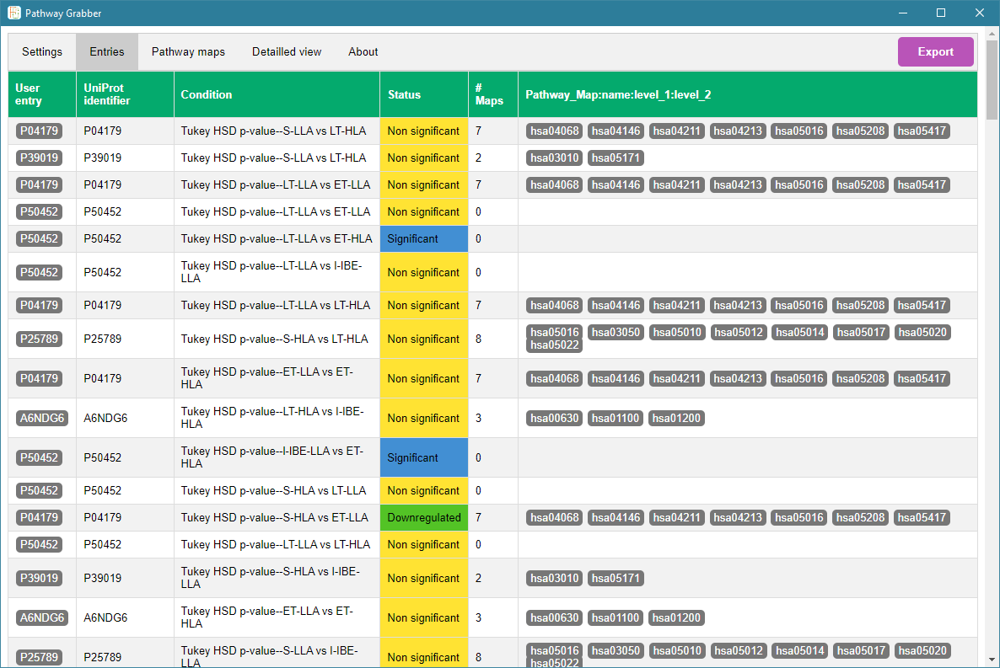
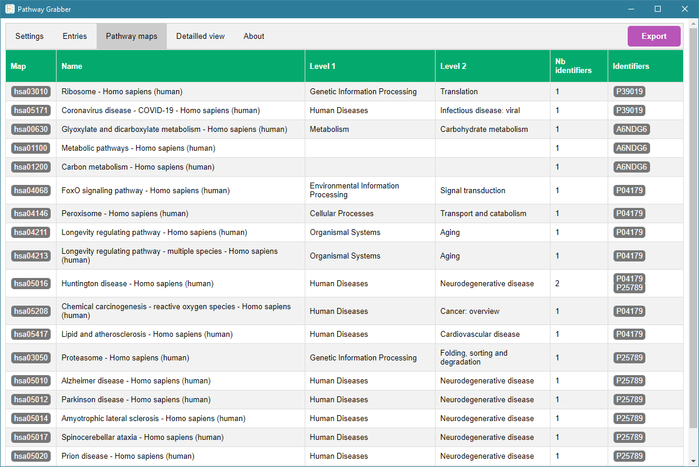
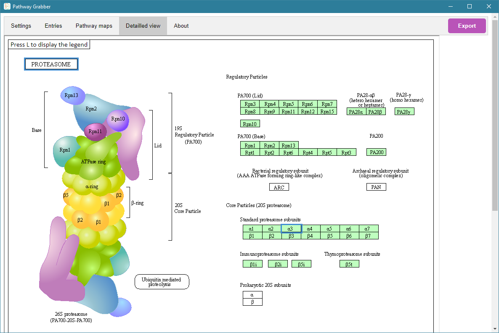
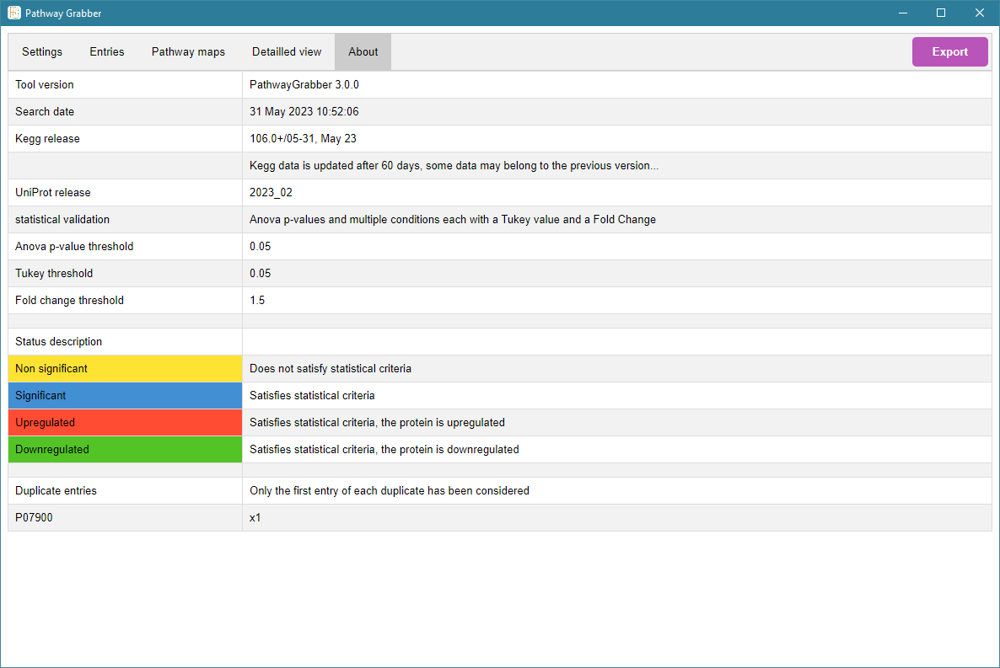

# Pathway Grabber

This repository is dedicated to the portable version of Pathway Grabber, that contains a graphical user interface. Pathway Grabber has been developped with Julia 1.8.5 and the GUI with ElectronJS.
The CLI version of Pathway Grabber is in the ext/ subdirectory, it was originally written as a Galaxy tool.

Pathway Grabber is a user-friendly tool for biologists and proteomists, helping them to get a comprehensive view of the molecular regulations from large lists of proteins, including the statistical metrics of differential analysis. Therefore, it allows to greatly accelerate omics data mining and it helps to nicely draw graphical representations of omics results (1, 2). Today, Pathway Grabber constitutes a solid basis for many future improvements (e.g. network analysis, extension to other resources like Reactome).

# Application case

The Kyoto Encyclopedia of Genes and Genomes (KEGG) is a database resource for understanding high-level functions of biological systems from large-scale molecular datasets. It has been developed together with a collection of tools for mapping molecular objects to KEGG pathway maps by the Kanehisa Laboratories (www.kanehisa.jp/). However, the online mapping procedure may not be straightforward and may require several steps to obtain the desired information. We developed Pathway Grabber as an integrated tool to search the KEGG database on a high-throughput basis for large omics datasets, and to obtain a visualisation that takes into consideration the differential analysis statistics applied after quantitative LC-MS/MS analyses.

From an Excel file containing UniProt or KEGG identifiers and associated statistical scoring values, including as well p-values from single (e.g. t-tests) or multiple comparisons (e.g. Anova and post-hoc tests) and fold changes, and the definition by the user of thresholds for each parameter, proteins are categorized as “non-significant” or “significant” and the information “upregulated” or “downregulated” is kept. In parallel, KEGG annotations are downloaded for each protein, which allows proteins from the dataset to be distributed among Pathway maps. A cache mechanism has been added to reduce the amount of data transfer, hence making the tool faster and decreasing the impact on the bandwidth. Extracted data is provided in the form of an Excel file and a list of HTML files.

Output HTML files correspond to all Kegg Pathway maps that contain at least one protein from the dataset. On these maps, the information that has been made available is highlighted using a colour code relative to the ‘statistical category’ (for any item of interest, whether it is, e.g., a module, a protein/gene, a compound, a relation). Additional details about statistical scoring is also given as tooltip text items. All the items in the HTML files are clickable and reroute the user to the corresponding KEGG entries, but these files can also be used completely offline, once they are generated they do not require an Internet connection anymore.
The ouput Excel file summarizes the whole information that is highlighted on maps, one sheet listing all the pathways associated with each with protein, another sheet listing all proteins associated to each revealed pathway.

    
    
    
    
    

# Instructions

Pathway Grabber has been designed to work on Windows systems. It was developped with Julia and ElectronJS so it is possible to adapt it to work on other systems.
To install Pathway Grabber, the easiest way is to download the [latest release](https://github.com/LSMBO/Pathway-Grabber/releases/latest) and double-click on the INSTALL.bat file. It will decompress and install the required packages.

If you clone the repository, you need to have nodeJS, git and Julia installed. The suggested versions that we used during the development were nodeJS v20.2.0, git v2.40.1 and Julia 1.8.5. You also have to install the Julia packages, the best way to do that is to check the command in the INSTALL.bat file. Finally you have to compile the ElectronJS code (follow the instructions [here](https://www.electronjs.org/docs/latest/tutorial/tutorial-packaging))

Now all you have to do is to execute the file **Pathway Grabber.bat** (or run *npm run start* if your environment variables are already set properly).
